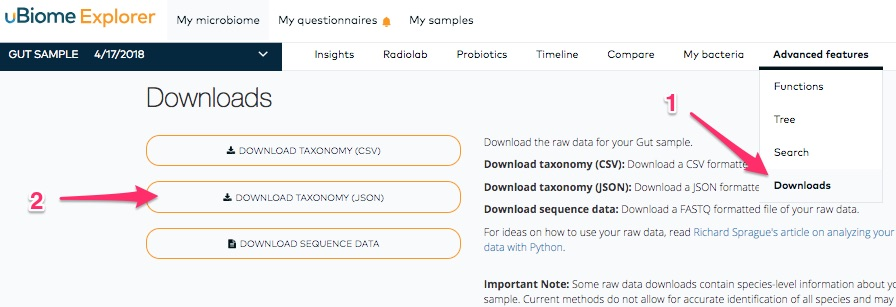
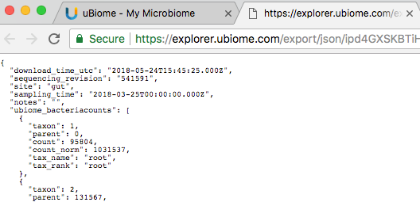
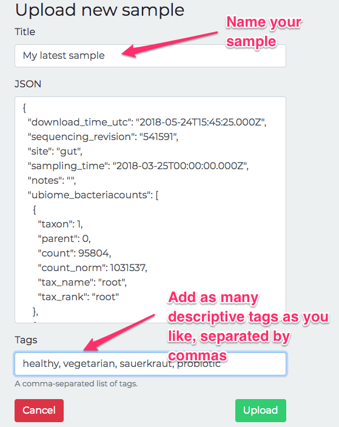

# Download your uBiome Data

### Download uBiome raw data as JSON

To use your uBiome data, you'll need to download it from the uBiome web site.  (We'll make this process much easier in the final version of the app).

Go to the [uBiome Explorer page](http://explorer.ubiome.com)  and click on the section labeled "Advanced" and then "Downloads":

You’ll see a page of JSON text representing what uBiome found in your sample:

 Most browsers offer a way to select the entire page (PC: control-A, Mac: command-A, iPhone: press and hold).  Do that, and then paste it to the JSON field of the ["Upload New Sample"](http://app.personalscience.com/ubiome/bacteria_json_create/) page.

