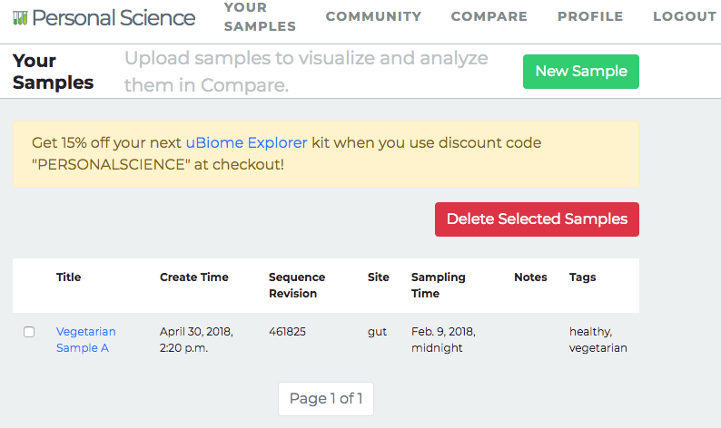
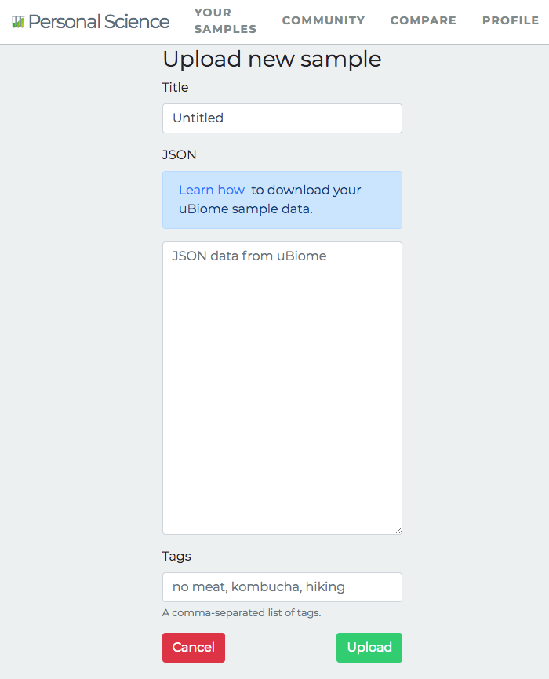

Using Personalscience.com
=========================

The Personal Science app will let you compare your health data to other people who have agreed, like you, to share their raw data.

Sharing and analyzing your data is a three part process:

1.  Upload your own raw data and tag it with descriptive attributes.
2.  Search the community for specific tags and save the results as a query
3.  View and analyze your results, either by themselves or in combination with a query you created.

Upload your data
----------------

Press the bright green "New Sample" button to add new raw data to your account.

You should see a screen that looks like this (@ref(fig:using\_psicom\_upload\_json)):

### Title

Remember that your uploaded data is intended to be shared with every other Personal Scientist, so try to fill the "Title" field with a name that is descriptive enough for others to tell something about the sample.

### JSON

Follow the instructions [here](https://github.com/personalscience/public/blob/master/docs/how-to-download-ubiome-json.md) if you're not sure how to get the raw JSON data from uBiome.

### Tags

Similarly, in the "Tags" field, enter items that will make your data easy to be found and relevant when somebody else is searching the Community for data like theirs. Some good examples of tags:

`healthy`, `vegetarian`, `lyme`, `keto`.

Some bad examples of tags:

`First sample`, `mine`, `after only 6.5 hrs of sleep`, `lkajdsfas`.

These tags aren't very useful because people aren't likely to search for them.
